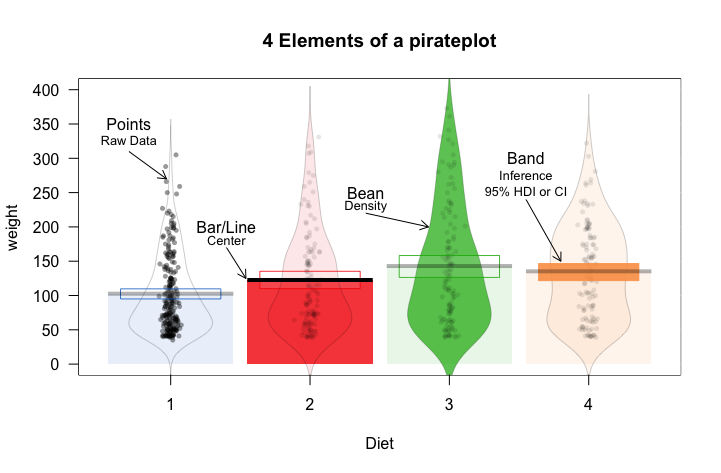

<!-- README.md is generated from README.Rmd. Please edit that file -->

[](https://travis-ci.org/ndphillips/yarrr)
[](https://CRAN.R-project.org/package=yarrr)
[](http://www.r-pkg.org/pkg/yarrr)

# yarrr

The `yarrr` package contains a mixture of data, functions and tutorials
supporting the e-book “YaRrr! The Pirate’s Guide to R”
(<https://bookdown.org/ndphillips/YaRrr/>).

To install the (stable) version from CRAN, run the following code

``` r
install.packages("yarrr") # install yarrr
library("yarrr") # load yarrr
yarrr.guide() # run main package guide
```

To install the latest developer version from CRAN, run the following
code

``` r
install.packages("devtools") # install yarrr
devtools::install_github("ndphillips/yarrr", build_vignettes = TRUE)
library("yarrr") # load yarrr
yarrr.guide() # run main package guide
```

Here are the most important parts of the package:

## pirateplot()

<figure>

<figcaption aria-hidden="true">Pirateplot Example</figcaption>
</figure>

The `pirateplot` function creates a pirateplot, a transparent (both
literally and figuratively) plot for displaying continuous data as a
function of 1, 2, or 3 discrete variables. Unlike traditional plots,
like barplots and boxplots, the pirateplot shows both raw data (jittered
points), descriptive statistics (line and/or bar), and inferential
statistics (95% Bayesian Highest Density Intervals or Confidence
Intervals), in one plot. While the default plot shows all these
elements, the user can easily customize the transparency of each element
using additional arguments.

See `?pirateplot` or
<https://cran.r-project.org/web/packages/yarrr/vignettes/pirateplot.html>
for more details
