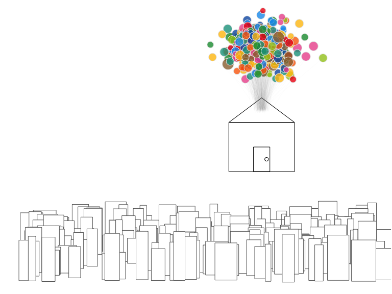

<!-- README.md is generated from README.Rmd. Please edit that file -->

[](https://travis-ci.org/ndphillips/yarrr)
[](https://CRAN.R-project.org/package=yarrr)
[](http://www.r-pkg.org/pkg/yarrr)

# yarrr 0.1.9

The `yarrr` package contains a mixture of data, functions and tutorials
supporting the e-book “YaRrr! The Pirate’s Guide to R”
(<https://bookdown.org/ndphillips/YaRrr/>).

## Installation

To install the (stable) version from CRAN, run the following code

``` r
install.packages("yarrr") # install yarrr
library("yarrr") # load yarrr
yarrr.guide() # run main package guide
```

To install the latest developer version from GitHub, run the following
code

``` r
# install.packages("devtools") # install devtools if needed
devtools::install_github("ndphillips/yarrr", build_vignettes = TRUE)
```

``` r
library(yarrr)
#> Warning: package 'jpeg' was built under R version 4.3.3
```

Once you have installed the package, you can run the main package guide
with the following code:

``` r
yarrr.guide() # run main package guide
```

Here are the most important parts of the package:

## pirateplot()

``` r
# Create a Pirate Plot using theme 1
pirateplot(
  formula = weight ~ Time,
  data = ChickWeight,
  theme = 1,
  main = "Pirateplot using theme = 1"
)
```

<!-- -->

The `pirateplot` function creates a pirateplot, a transparent (both
literally and figuratively) plot for displaying continuous data as a
function of 1, 2, or 3 discrete variables. Unlike traditional plots,
like barplots and boxplots, the pirateplot shows both raw data (jittered
points), descriptive statistics (line and/or bar), and inferential
statistics (95% Bayesian Highest Density Intervals or Confidence
Intervals), in one plot. While the default plot shows all these
elements, the user can easily customize the transparency of each element
using additional arguments.


See `?pirateplot` or
<https://cran.r-project.org/web/packages/yarrr/vignettes/pirateplot.html>
for more details

## piratepal()

`piratepal()` is a function that returns color palettes. See
`?piratepal` or
<https://cran.r-project.org/web/packages/yarrr/vignettes/piratepal.html>
for more details

To see all of the palettes, run `piratepal("all")`

``` r
piratepal(palette = "all")
```


Once you find a palette you’d like to use, you can return the colors as
a vector by specifying the name of the palette in the `palette`
argument. Here is the Basel palette

``` r
piratepal(
  palette = "basel",
  trans = .5,
  plot.result = T
)
```


Let’s use the basel palette to draw the house from the Pixar film
[Up](https://www.youtube.com/watch?v=pkqzFUhGPJg)

``` r
# Set up balloons
balloon.colors <- piratepal("basel", trans = .2)
balloon.x <- rnorm(500, 0)
balloon.y <- rnorm(500, 4, 1)

par(mar = rep(.1, 4))
plot(1,
  xlim = c(-15, 7), ylim = c(-15, 7),
  xlab = "", ylab = "", type = "n",
  xaxt = "n", yaxt = "n", bty = "n"
)

# skyline
start.x <- runif(200, -15, 7)
start.y <- sort(runif(200, -15, -12), decreasing = T)
heights <- runif(200, 2, 4)
widths <- runif(200, .25, 1.5)

rect(start.x, start.y, start.x + widths, start.y + heights,
  col = "white", border = gray(.4)
)

# house
rect(-2, -6, 2, -2)
polygon(
  c(-2, 0, 2),
  c(-2, 0, -2)
)
rect(-.5, -6, .5, -4)
points(.3, -5)

# strings
line.start.x <- rnorm(500, 0, .2)
line.start.y <- -1 + rnorm(500, 0, .1)
segments(line.start.x,
  line.start.y,
  balloon.x, balloon.y,
  lty = 1, col = gray(.5, .1), lwd = .2
)

# balloons
points(balloon.x, balloon.y,
  pch = 21,
  bg = balloon.colors,
  col = gray(.9), cex = rnorm(100, 2, .3)
)
```


